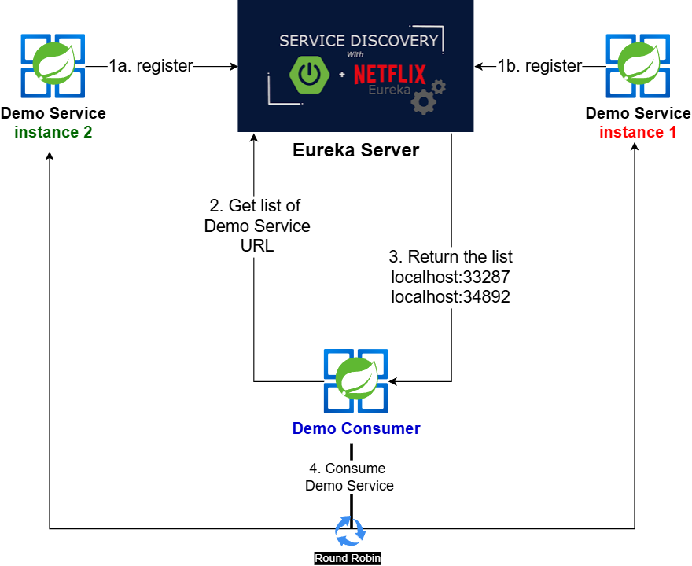
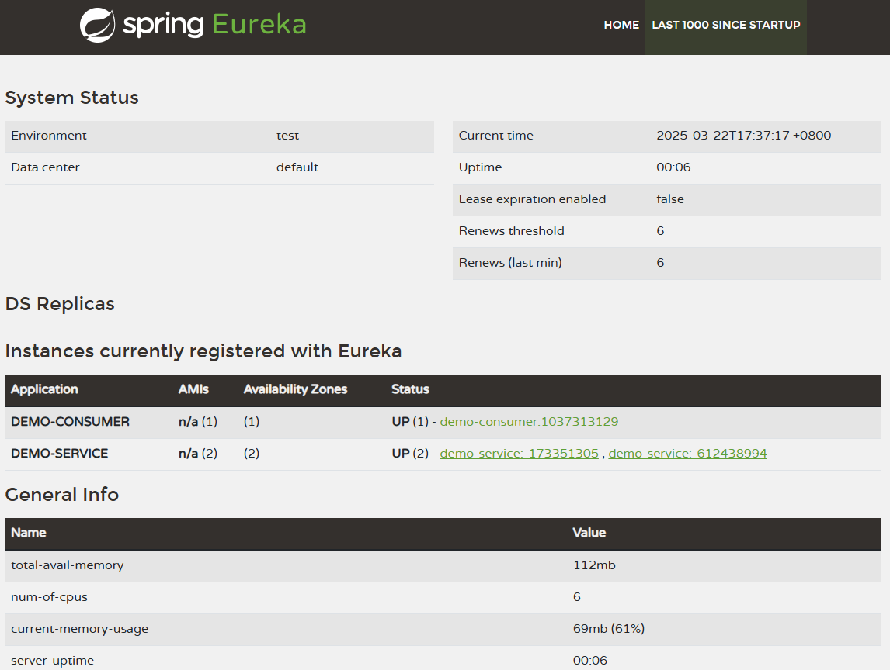
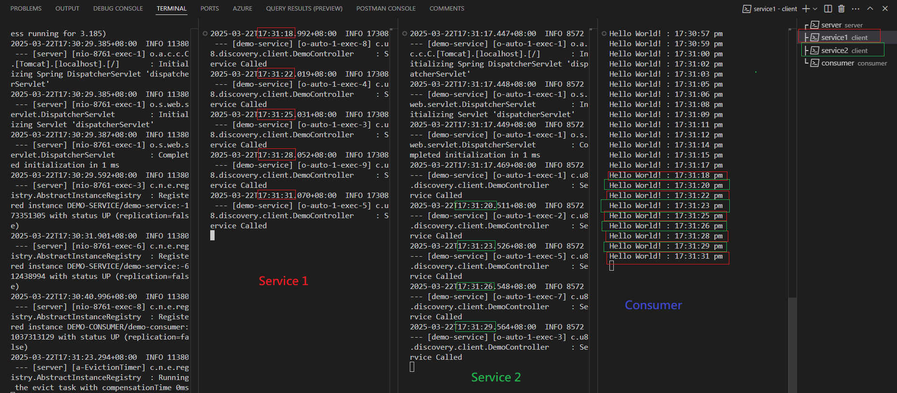

### Introduction

This a demo to illustrate the Service Discovery capability provided by Netflix Eureka. 

### Architecture

The __Eureka Server__ provides registration and discovery services for microservices. 

The __Demo Service__ provide a simple web service that returns a string. Two instances of the demo service are registered with the Eureka server.

The __Demo Consumer__ consumes the web service provided by the Demo Service. It retrieves the address of the Demo Service from the Eureka server and makes a call to it. It consumes Demo Service in a ***round robin*** fashion.

### The Effect

As shown in below diagram, the Demo Consumer is able to consume the Demo Service in a ***round robin*** fashion.

